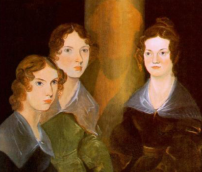
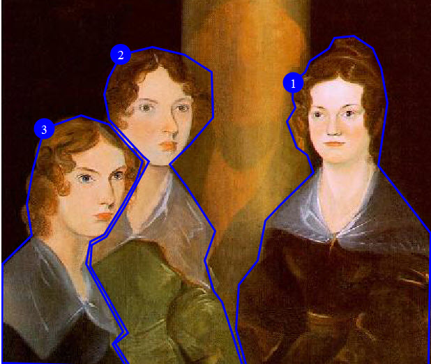

# Example: Alternate text for an image map

In this scenario, alternate text is provided for an image map.

The following image shows "The Brontë Sisters". This portrait is in the collection of the National Portrait Gallery, London. The images of the three Brontë sisters \(Charlotte, Emily, and Ann\) are linked to their Wikipedia pages.



The following code sample shows how the `<imagemap>` element is used to generate the above image map, as well as how alternate text can be provided to ensure accessibility:

```
<imagemap id="bronte-sisters">
  <image href="Bronte_Sisters.jpg" id="bronte-sisters">
    **&lt;alt&gt;Portrait of "The Brontë Sisters"&lt;/alt&gt;**
  </image>
  <!-- Area #1: Charlotte Brontë -->
  <area>
    <shape>poly</shape>
    <coords>408, 345, 410, 223, 360, 158, 369, 98, 363, 65, 355, 46,
          337, 34, 318, 36, 313, 46, 295, 58, 290, 69, 279, 79, 278, 95,
          281, 103, 273, 116, 282, 141, 292, 148, 298, 165, 266, 196, 252,
          211, 245, 249, 227, 272, 224, 315, 234, 350, 408, 349</coords>
    <xref format="html" scope="external"
          href="https://en.wikipedia.org/wiki/Charlotte_Bront%C3%AB">
          **Charlotte Brontë**</xref>
  </area>
  <!-- Area #2: Emily Brontë -->
  <area>
    <shape>poly</shape>
    <coords>228, 343, 211, 289, 203, 278, 194, 249, 204, 221, 177, 178,
          161, 157, 180, 138, 202, 112, 201, 69, 175, 52, 144, 45, 114, 52,
          102, 75, 98, 90, 103, 114, 118, 131, 135, 149, 141, 154, 118,
          197, 100, 226, 86, 234, 85, 254, 121, 318, 109, 328, 123, 350,
          230, 349</coords>
    <xref format="html" scope="external"
          href="https://en.wikipedia.org/wiki/Emily_Bront%C3%AB">
          **Emily Brontë**</xref>
  </area>
  <!-- Area #3: Anne Brontë -->
  <area>
    <shape>poly</shape>
    <coords>0, 347, 1, 252, 29, 225, 24, 195, 30, 161, 41, 123, 76,
          110, 103, 119, 119, 137, 135, 154, 129, 172, 116, 195, 98, 224,
          85, 231, 81, 252, 116, 317, 106, 329, 119, 350</coords>
    <xref format="html" scope="external"
          href="https://en.wikipedia.org/wiki/Anne_Bront%C3%AB">
          **Anne Brontë**</xref>
  </area>
</imagemap>
```

The `<alt>` element provides alternate text for the image as a whole, and the content of the `<xref>` elements provide alternate text for each of the linked regions.

The following image shows the areas that are defined by the image map:



The following table lists the link targets and alternate text for each of the defined areas:

|Area|Alternate text|Link target|
|----|--------------|-----------|
|**1**|Charlotte Brontë|[Wikipedia entry for Charlotte Brontë](https://en.wikipedia.org/wiki/Charlotte_Bront%C3%AB)|
|**2**|Emily Brontë|[Wikipedia entry for Emily Brontë](https://en.wikipedia.org/wiki/Emily_Bront%C3%AB)|
|**3**|Anne Brontë|[Wikipeda entry for Anne Brontë](https://en.wikipedia.org/wiki/Anne_Bront%C3%AB)|

**Parent topic:**[Examples of DITA markup for accessibility](../../archSpec/base/examples-of-dita-markup-for-accessibility.md)

