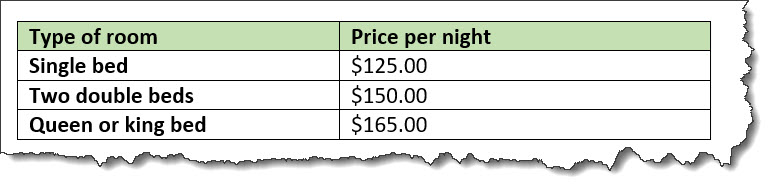

# Example: Simple table with accessibility markup

In this scenario, the topic author uses a header row and the `@keycol` attribute to ensure that the table is accessible

In the following code sample, the `<sthead>` element identifies the header row, and `@keycol` attribute identifies the header column:

```
<simpletable frame="all" relcolwidth="1* 1*" **keycol="1"**>
  **&lt;sthead&gt;
    &lt;stentry&gt;Type of room&lt;/stentry&gt;
    &lt;stentry&gt;Price per day&lt;/stentry&gt;
  &lt;/sthead&gt;**
  <strow>
    <stentry>Single bed</stentry>
    <stentry>$125.00</stentry>
  </strow>
  <strow>
    <stentry>Two double beds</stentry>
    <stentry>$150.00</stentry>
  </strow>
  <strow>
    <stentry>Queen or king bed</stentry>
    <stentry>$165.00</stentry>
  </strow>
</simpletable>
```

This table might be rendered in the following way:



**Parent topic:**[Examples of DITA markup for accessibility](../../archSpec/base/examples-of-dita-markup-for-accessibility.md)

