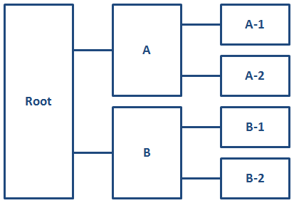

# Addressing keys across scopes

When referencing key definitions that are defined in a different key scope, key names might need to be qualified with key scope names.

A root map might contain any number of key scopes; relationships between key scopes are discussed using the following terms:

-   **child scope**

    A key scope that occurs directly within another key scope. exampleFor example, in the figure below, key scopes "A-1" and "A-2" are child scopes of key scope "A".

-   **parent scope**

    A key scope that occurs one level above another key scope. exampleFor example, in the figure below, key scope "A" is a parent scope of key scopes "A-1" and "A-2".

-   **ancestor scope**

    A key scope that occurs any level above another key scope. exampleFor example, in the figure below, key scopes "A" and "Root" are both ancestor scopes of key scopes "A-1" and "A-2".

-   **descendant scope**

    A key scope that occurs any level below another key scope. exampleFor example, in the figure below, key scopes "A", "A-1", and "A-2" are all descendant scopes of the implicit, root key scope.

-   **sibling scope**

    A key scope that shares a common parent with another key scope. exampleFor example, in the figure below, key scopes "A" and "B" are sibling scopes; they both are children of the implicit, root key scope.

-   **key scope hierarchy**

    A key scope and all of its descendant scopes.

## Keys that are defined in parent key scopes

The key space that is associated with a key scope also includes all key definitions from its parent key scope. If a key name is defined in both a key scope and its parent scope, the key definition in the parent scope takes precedence. This means that a key definition in a parent scope overrides all definitions for the same key name in all descendant scopes. This enables map authors to override the keys that are defined in submaps, regardless of whether the submaps define key scopes.

In certain complex cases, a scope-qualified key name \(such as scope.key\) can override an unqualified key name from the parent scope. See [Example: How key scopes affect key precedence](example-keys-scope-defining-precedence.md).

## Keys that are defined in child key scopes

The key space associated with a key scope does not include the *unqualified* key definitions from the child scopes. However, it does include scope-qualified keys from the child scopes. This enables sibling key scopes to have different key definitions for the same key name.

A scope-qualified key name is a key name, prepended by one or more key scope names and separated by periods. exampleFor example, to reference a key "keyName" defined in a child scope named "keyScope", specify `keyref="keyScope.keyName"`.

If a key scope has multiple names, its keys can be addressed from its parent scope using any of the scope names. exampleFor example, if a key scope is defined with `keyscope="a b c"`, and it contains a key name of "product", that key can be referenced from the parent scope by `keyref="a.product"`, `keyref="b.product"`, or `keyref="c.product"`.

Because a child scope contributes its scope-qualified keys to its parent scope, and that parent scope contributes *its* scope-qualified keys to *its* parent scope, it is possible to address the keys in any descendant scope by using the scope-qualified key name. exampleFor example, consider a key scope named "ancestorScope" that has a child scope named "parentScope" which in turn has a child scope named "childScope". The scope "childScope" defines a key named "keyName". To reference the key "keyName" from scope "ancestorScope", specify the scope-qualified key name: `keyref="parentScope.childScope.keyName"`.

## Keys that are defined in sibling key scopes

Because a parent key scope contains scope-qualified keys from all of its child scopes, and a child scope inherits all of the key definitions \(including scope-qualified keys\) from its parent scope, it is possible for a child scope to reference its own scope-qualified keys, as well as those defined by its sibling scopes.

exampleFor example, consider two sibling scopes, "scope1" and "scope2". Each scope defines the key "productName". References to "productName" in each scope resolve to the local definition. However, since each scope inherits the scope-qualified keys that are available in their parent scope, either scope can reference "scope1.productName" and "scope2.productName" to refer to the scope-specific definitions for that key.

**Parent topic:**[Indirect key-based addressing](../../archSpec/base/key-based-addressing.md)

