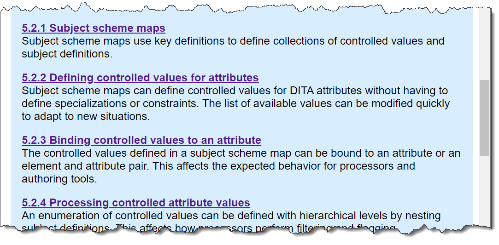

# Link previews

The DITA specification uses the content of the DITA `<shortdesc>` element to provide link previews for its readers. These link previews are visually highlighted by a colored background.

The link previews serve as enhanced navigation aids, enabling readers to more easily locate content. This usability enhancement is one of the ways in which the specification illustrates the capabilities of DITA and exemplifies DITA best practices.

The following screen capture illustrates how link previews are displayed in the HTML5 version of the specification:

**Parent topic:**[Formatting conventions in the HTML5 version of the specification](../../../commonspec/specification/introduction/formatting-conventions-html-output.md)

